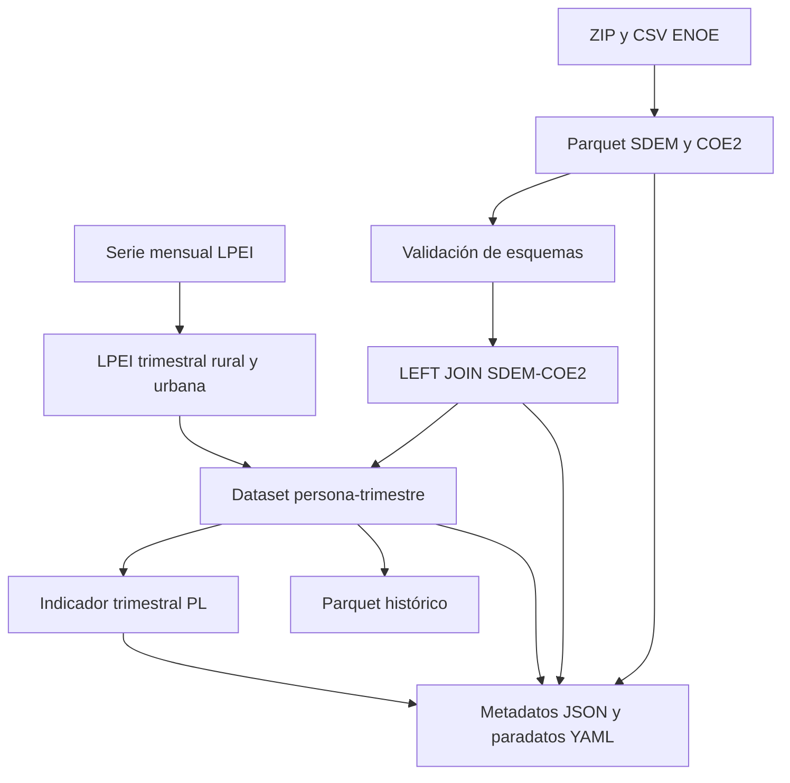

# ENOE Utilities

`enoe-utilities` es una biblioteca de Python para procesar microdatos de la **Encuesta Nacional de Ocupación y Empleo (ENOE)** y reproducir un flujo trimestral de cálculo de pobreza laboral con resultados auditables.

La biblioteca convierte archivos ZIP/CSV a Parquet, valida esquemas históricos, une SDEM con COE2, construye conjuntos analíticos persona-trimestre, calcula el porcentaje de población en pobreza laboral y genera metadatos JSON y paradatos YAML.

> Esta Wiki documenta la versión `0.1.0`. La metodología oficial pertenece al INEGI y al CONEVAL. El repositorio ofrece una implementación reproducible y no sustituye la documentación institucional.

## Rutas de lectura

### Comprender la encuesta

1. [ENOE: propósito y alcance](https://github.com/DevArmando99/enoe-utilities/wiki/ENOE-proposito-y-alcance)
2. [Diseño conceptual y estadístico](https://github.com/DevArmando99/enoe-utilities/wiki/Diseno-conceptual-y-estadistico)
3. [Historia metodológica 2005-2026](https://github.com/DevArmando99/enoe-utilities/wiki/Historia-metodologica-2005-2026)
4. [Microdatos y estructura de archivos](https://github.com/DevArmando99/enoe-utilities/wiki/Microdatos-y-estructura)

### Comprender el cálculo

1. [LPEI y pobreza laboral](https://github.com/DevArmando99/enoe-utilities/wiki/LPEI-y-pobreza-laboral)
2. [Variables del proyecto](https://github.com/DevArmando99/enoe-utilities/wiki/Variables-del-proyecto)
3. [Llaves y relaciones](https://github.com/DevArmando99/enoe-utilities/wiki/Llaves-y-relaciones)
4. [Metodología de cálculo](https://github.com/DevArmando99/enoe-utilities/wiki/Metodologia-de-calculo)

### Ejecutar y auditar

1. [Guía de ejecución](https://github.com/DevArmando99/enoe-utilities/wiki/Guia-de-ejecucion)
2. [API pública](https://github.com/DevArmando99/enoe-utilities/wiki/API-publica)
3. [Metadatos y paradatos](https://github.com/DevArmando99/enoe-utilities/wiki/Metadatos-y-paradatos)
4. [Validación y control de calidad](https://github.com/DevArmando99/enoe-utilities/wiki/Validacion-y-control-de-calidad)
5. [Reproducibilidad y procedencia](https://github.com/DevArmando99/enoe-utilities/wiki/Reproducibilidad-y-procedencia)
6. [Errores frecuentes](https://github.com/DevArmando99/enoe-utilities/wiki/Errores-frecuentes)
7. [Referencias técnicas](https://github.com/DevArmando99/enoe-utilities/wiki/Referencias-tecnicas)

## Flujo general

## Alcance actual

- Procesamiento trimestral de microdatos ENOE.
- Compatibilidad con equivalencias históricas seleccionadas.
- Resultados analíticos con una fila por persona y trimestre.
- Agregación del ingreso a nivel hogar para clasificar a sus integrantes.
- Cálculo ponderado con `fac_tri`.
- Auditoría de conversiones, cruces, imputación, exclusión, cobertura y resultados.

Antes de utilizar resultados en investigación o producción, consulta [Alcance y advertencias](https://github.com/DevArmando99/enoe-utilities/wiki/Alcance-y-advertencias).

## Enlaces

- [Repositorio](https://github.com/DevArmando99/enoe-utilities)
- [Ejemplo completo 2025-2026](https://github.com/DevArmando99/enoe-utilities/tree/main/examples/labor_poverty_2025_2026)
- [Carpeta ejecutable en Google Drive](https://drive.google.com/drive/folders/1WyXtJdbN__LyOo1la5rE7mNs5r3bFE4m?usp=sharing)
- [Página oficial de la ENOE](https://www.inegi.org.mx/programas/enoe/15ymas/)
- [Pobreza laboral e ITLP](https://www.coneval.org.mx/Medicion/Paginas/ITLP-IS_pobreza_laboral.aspx)

