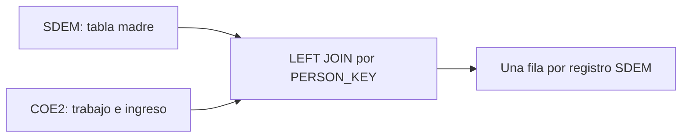

# Llaves y relaciones

## Llave canónica de persona

```python
PERSON_KEY = [
    "cd_a", "cve_ent", "con", "upm", "d_sem", "n_pro_viv",
    "v_sel", "n_hog", "h_mud", "n_ent", "per", "n_ren",
]
```

La combinación identifica una fila de persona dentro del trimestre procesado. Las columnas deben normalizarse como texto no vacío antes de formar identificadores o ejecutar el join.

## Llave de hogar

```python
HOUSEHOLD_KEY = [column for column in PERSON_KEY if column != "n_ren"]
```

`n_ren` distingue a la persona dentro del hogar. Al retirarlo, la llave permite agrupar a los integrantes válidos para sumar ingresos y calcular ingreso per cápita.

## Relación SDEM-COE2



El merge es un `LEFT JOIN` con SDEM como tabla madre. Por diseño:

- todas las filas de SDEM deben conservarse;
- una persona puede no tener correspondencia en COE2;
- `cruce_coe2` registra `both` o `left_only`;
- los datos de COE2 no deben multiplicar filas de SDEM;
- una llave duplicada o incompleta impide un merge estricto.

## Identificadores derivados

El dataset analítico construye:

- `id_hogar`: componentes de la llave de hogar concatenados;
- `id_persona`: componentes de la llave de persona concatenados;
- `id_hogar_periodo`: periodo más `id_hogar`;
- `id_persona_periodo`: periodo más `id_persona`.

Agregar el periodo evita colisiones entre trimestres. Esto no convierte la llave en identificador longitudinal permanente.

## Validaciones mínimas

1. No debe haber componentes nulos o vacíos en la llave de persona.
2. La llave de persona debe ser única dentro del periodo.
3. La cantidad de personas únicas debe coincidir con las filas del Parquet unido.
4. `both + left_only` debe ser igual al total de filas.
5. Una fila `left_only` no debe contener datos procedentes de COE2.
6. Las variables constantes del hogar, cuando se validan, deben ser consistentes dentro de la llave de hogar.

## Por qué no se usa solo una llave de hogar

El indicador requiere agregación por hogar, pero la salida conserva características individuales y aplica `fac_tri` por persona. Una llave exclusivamente doméstica perdería el grano persona-trimestre y podría producir ponderaciones incorrectas.

